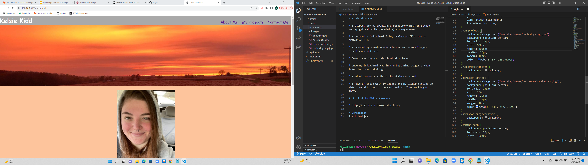

# Kidds Showcase

* I started off by creating a repository with in github and my gitbash with (hopefully) a unique name.

* I created a index.html file, style.css file, and a README.md file.

* I created my assets/css/style.css and assets/images directories and file.

* Began creating my index.html structure. 

* Once my index.html was in the beginning stages I then tried to insert styling.

# URL link to Kidds Showcase

* http://127.0.0.1:5500/index.html

# Screenshot
